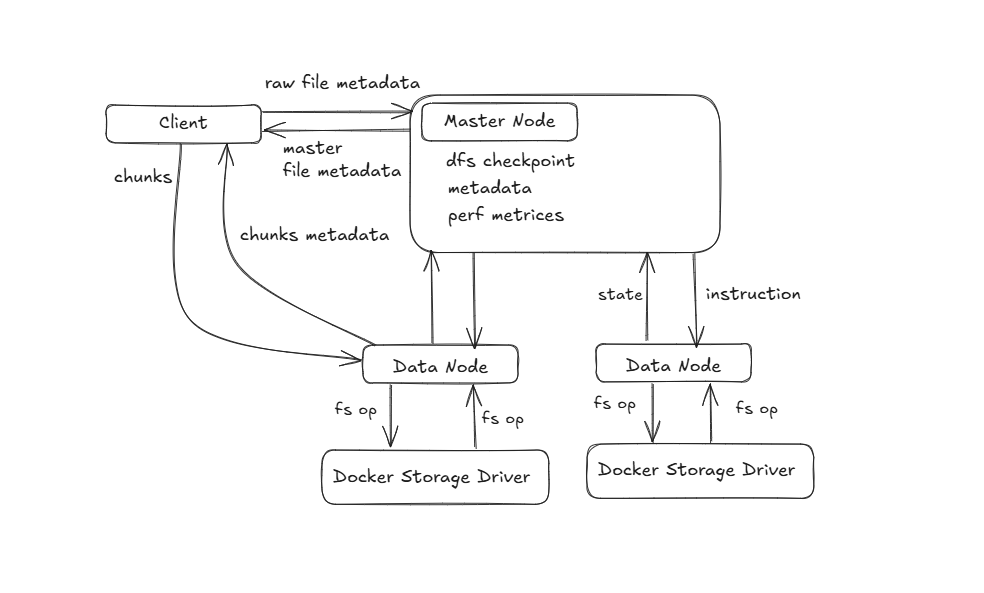

# Monty Python McChukin



Monty Python McChukin is a **Distributed File System (DFS)** built on Docker, created for educational purposes. It implements a minimal feature set inspired by the **Google File System (GFS)** white paper, with room for enhancements. This project serves as a practical introduction to DFS concepts and architecture, as well forces you to understand Docker internals. In Fork and Play section guide on things to implement.

## Motivation

After reading the [Google File System white paper](https://static.googleusercontent.com/media/research.google.com/en//archive/gfs-sosp2003.pdf), I was motivated to explore DFS in depth. This project is an implementation of baseline DFS features based on the paper's architecture.

I maintain a private fork for further feature development, and I encourage others to do the same.

**Note:** Contributions are **closed**. Feel free to fork and experiment on your own, ask me any question.

### Related Projects

- [3FS - A Distributed File System](https://github.com/deepseek-ai/3FS)

## Architecture

The system consists of three main components:

### 1. **Master Node** (Coordinator)

- Manages metadata for files and their chunks
- Tracks active data nodes
- Allocates file chunks to data nodes
- Logs and monitors read/write performance

### 2. **Data Nodes** (Storage Nodes)

- Store actual file chunks
- Report read/write throughput
- Send periodic heartbeats to the master

### 3. **Client** (User Interface)

- Splits files into chunks for upload
- Reassembles chunks for download
- Communicates with the master for file metadata
- Directly transfers data to and from data nodes

## Key Features

- **File Chunking** – Files are split into configurable-size chunks (default: **4MB**)
- **Distributed Storage** – Chunks are distributed across multiple data nodes
- **Metadata Management** – The master node tracks file-to-chunk mappings
- **Performance Monitoring** – Read/write throughput is logged at the data node and master level
- **Parallel Processing** – Multi-threaded uploads and downloads for improved efficiency

## Usage

To start the system,

1. have file of whatever kind of minimal size > 16 MB so the McChukin works within client/files/
2. build and run the containers using:

```sh
docker-compose up - d
```

### 1. Upload a file:

```sh
docker exec -it dfs-client python client.py upload /files/data.pdf
```

### 2. Download a file:

```sh
docker exec -it dfs-client python client.py download data.pdf /files/data.pdf
```

### 3. List stored files:

```sh
docker exec -it dfs-client python client.py listfiles
```

### 4. Get file metadata:

```sh
docker exec -it dfs-client python client.py info data.pdf
```

The system continuously logs read/write performance across data nodes, providing visibility into system efficiency and potential bottlenecks.

---

## Fork and Play guide

Below are enhacements and features you could implement based on Google File System white paper :

- Chunk Replication: Implement multiple replicas (e.g., default 3, as in GFS) to ensure data availability and fault tolerance. This involves the master tracking replica locations and initiating new replicas if a node fails, enhancing reliability for educational exploration.

  - Master node

  ```Python
  FUNCTION create_file(filename, filesize):
      chunk_size = metadata['chunk_size']
      num_chunks = CEIL(filesize / chunk_size)
      active_nodes = GET_ACTIVE_DATANODES()
      IF LENGTH(active_nodes) < replication_factor (e.g., 3):
          RETURN ERROR "Insufficient datanodes for replication"

      FOR i FROM 0 TO num_chunks - 1:
          chunk_id = GENERATE_CHUNK_ID(file_id, i)
          replicas = []
          FOR j FROM 0 TO replication_factor - 1:
              node_index = (i + j) % LENGTH(active_nodes)
              node_id = active_nodes[node_index]
              replicas.APPEND({
                  'chunk_id': chunk_id,
                  'node_id': node_id,
                  'node_url': datanodes[node_id]['url'],
                  'start': i * chunk_size,
                  'size': MIN(chunk_size, filesize - i * chunk_size)
              })
          metadata['files'][filename]['chunks'].APPEND(replicas)
      SAVE_METADATA()
      RETURN file_id, chunks
  ```

  - data node

  ```Python
  FUNCTION store_chunk(chunk_id):
      WRITE chunk_data TO DISK
      REPORT_METRICS()
  ```

  - Client

  ```Python
  FUNCTION upload(file_path, name):
      file_info = REGISTER_FILE_WITH_MASTER(filename, filesize)
      chunks = split_file(file_path, file_info['chunks'])
      FOR EACH chunk IN chunks:
          FOR EACH replica IN chunk:
              UPLOAD_CHUNK(replica['node_url'], replica['chunk_id'], chunk['data'])
  ```

- Larger Chunk Size: Increase the default chunk size from 4MB to 64MB, as in GFS, to reduce metadata overhead and improve performance for large files. This can be configurable, allowing users to experiment with different sizes and observe impacts.

  - master node

  ```Python
  FUNCTION upload(file_path, name):
      file_info = REGISTER_FILE_WITH_MASTER(filename, filesize)
      chunks = split_file(file_path, file_info['chunks'])
      FOR EACH chunk IN chunks:
          FOR EACH replica IN chunk:
              UPLOAD_CHUNK(replica['node_url'], replica['chunk_id'], chunk['data'])
  ```

  - client: No logic change; uses master's chunk_size implicitly via chunks_info

- Lease-based Mutation Ordering: Use a lease mechanism, as in GFS, where the master grants time-limited write permissions to a primary replica, ensuring consistent mutation order. This addresses concurrent write issues, a critical aspect for distributed systems.

  - master node

  ```Python
  FUNCTION assign_lease(chunk_id, primary_node_id):
      lease = {
          'chunk_id': chunk_id,
          'primary_node_id': primary_node_id,
          'expires_at': CURRENT_TIME() + 60  #
      }
      metadata['leases'][chunk_id] = lease
      SAVE_METADATA()
      RETURN lease

  FUNCTION create_file(filename, filesize):
      FOR EACH chunk IN chunks:
          primary_node = chunk[0]['node_id']
          lease = assign_lease(chunk[0]['chunk_id'], primary_node)
          chunk.APPEND({'lease': lease})
  ```

  - data node

  ```Python
  FUNCTION store_chunk(chunk_id):
      IF REQUEST includes lease AND lease['primary_node_id'] == NODE_ID:
          WRITE chunk_data TO DISK
          FORWARD chunk_data TO SECONDARY_REPLICAS
      ELSE IF REQUEST from primary AND valid_lease:
          WRITE chunk_data TO DISK
      ELSE:
          RETURN ERROR "Invalid lease or not primary"
  ```

  - client

  ```Python
  FUNCTION upload_chunk(chunk):
      primary_replica = chunk[0]  # First replica is primary
      UPLOAD_TO(primary_replica['node_url'], chunk['chunk_id'], chunk['data'], chunk['lease'])
  ```

- Append Operations Optimization: Optimize for append-only files, a key GFS feature, by implementing atomic append operations. This allows multiple clients to append concurrently, useful for scenarios like producer-consumer queues, enhancing the system's educational value.

  - master node

  ```Python
  FUNCTION append_file(filename, append_size):
      IF filename NOT IN metadata['files']:
          RETURN ERROR "File not found"
      file_info = metadata['files'][filename]
      last_chunk = file_info['chunks'][-1]
      IF last_chunk['size'] < chunk_size:
          RETURN last_chunk
      ELSE:
          new_chunk = CREATE_NEW_CHUNK(file_info, append_size)
          file_info['chunks'].APPEND(new_chunk)
          SAVE_METADATA()
          RETURN new_chunk
  ```

  - data node

  ```Python
  FUNCTION append_chunk(chunk_id, data):
      chunk_path = GET_CHUNK_PATH(chunk_id)
      WITH FILE_LOCK(chunk_path):
          APPEND data TO chunk_path
      UPDATE_SIZE_AND_REPORT()
  ```

  - client

  ```Python
  FUNCTION append(filename, data):
      chunk_info = REQUEST_APPEND_FROM_MASTER(filename, LENGTH(data))
      UPLOAD_CHUNK(chunk_info['node_url'], chunk_info['chunk_id'], data)
  ```

- Lazy Garbage Collection: Implement lazy deletion, where deleted files are marked and removed periodically, as in GFS. This simplifies storage management and reduces immediate load, providing a practical learning opportunity in resource efficiency.

  - master node

  ```Python
  FUNCTION delete_file(filename):
      IF filename IN metadata['files']:
          metadata['files'][filename]['status'] = 'deleted'
          metadata['files'][filename]['deleted_at'] = CURRENT_TIME()
          SAVE_METADATA()

  FUNCTION garbage_collect():
      FOR EACH file IN metadata['files']:
          IF file['status'] == 'deleted' AND CURRENT_TIME() - file['deleted_at'] > retention_period:
              FOR EACH chunk IN file['chunks']:
                  NOTIFY_DATALODE(chunk['node_id'], chunk['chunk_id'])
              REMOVE file FROM metadata['files']
      SAVE_METADATA()
  ```

  - data node

  ```Python
  FUNCTION delete_chunk(chunk_id):
      REMOVE_FILE(GET_CHUNK_PATH(chunk_id))
  ```

- Data Integrity Checks: Add checksums for each chunk, as GFS does, to detect and handle data corruption. Data nodes can compute and report checksums, with the master verifying consistency across replicas, ensuring data reliability.

  - master node

  ```Python
  FUNCTION create_file(filename, filesize):
      FOR EACH chunk IN chunks:
          chunk['checksum'] = NULL
  ```

  - data node

  ```Python
  FUNCTION store_chunk(chunk_id):
      chunk_data = REQUEST_DATA()
      checksum = CALCULATE_CHECKSUM(chunk_data)  # e.g., SHA-256
      WRITE(chunk_data, chunk_path)
      STORE(checksum, chunk_path + '.checksum')
      RETURN checksum TO MASTER

  FUNCTION retrieve_chunk(chunk_id):
      chunk_data = READ(chunk_path)
      stored_checksum = READ(chunk_path + '.checksum')
      IF CALCULATE_CHECKSUM(chunk_data) != stored_checksum:
          RETURN ERROR "Checksum mismatch"
      RETURN chunk_data
  ```

  - client

  ```Python
  FUNCTION upload_chunk(chunk):
      response = UPLOAD(chunk)
      UPDATE_METADATA_WITH_CHECKSUM(chunk['chunk_id'], response['checksum'])
  ```

- Improved Fault Tolerance and Recovery: Enhance beyond basic heartbeats by implementing robust failure detection and recovery, such as re-replicating chunks from failed nodes. This aligns with GFS's design for commodity hardware, offering a deeper understanding of fault tolerance.

  - master node

  ```Python
  FUNCTION monitor_datanodes():
      WHILE TRUE:
          FOR EACH node IN datanodes:
              IF CURRENT_TIME() - node['last_heartbeat'] > 30:
                  REMOVE node FROM datanodes
                  RE_REPLICATE_CHUNKS(node)
          SLEEP(10)

  FUNCTION re_replicate_chunks(failed_node_id):
      FOR EACH file IN metadata['files']:
          FOR EACH chunk IN file['chunks']:
              IF failed_node_id IN chunk['node_ids']:
                  new_node = SELECT_NEW_DATANODE()
                  INITIATE_REPLICATION(chunk, new_node)
  ```

  - data node

  ```Python
  FUNCTION replicate_chunk(chunk_id, target_node_url):
      chunk_data = READ(chunk_id)
      SEND(chunk_data, target_node_url, chunk_id)
  ```

- Variable Replication Levels: Allow users to specify the number of replicas for files or chunks, providing flexibility. This mirrors GFS's user-specified levels, enabling experimentation with redundancy vs. storage costs.

  - master node

  ```Python
  FUNCTION create_file(filename, filesize, replication_factor=3):
      FOR i FROM 0 TO num_chunks - 1:
          FOR j FROM 0 TO replication_factor - 1:
              ADD_REPLICA(chunk, active_nodes)
  ```

  - data node

  ```Python
  FUNCTION store_chunk(chunk_id):
      chunk_data = REQUEST_DATA()
      checksum = CALCULATE_CHECKSUM(chunk_data)  # e.g., SHA-256
      WRITE(chunk_data, chunk_path)
      STORE(checksum, chunk_path + '.checksum')
      RETURN checksum TO MASTER

  FUNCTION retrieve_chunk(chunk_id):
      chunk_data = READ(chunk_path)
      stored_checksum = READ(chunk_path + '.checksum')
      IF CALCULATE_CHECKSUM(chunk_data) != stored_checksum:
          RETURN ERROR "Checksum mismatch"
      RETURN chunk_data
  ```

  - client

  ```Python
  FUNCTION upload(file_path, name, replication_factor):
      REGISTER_FILE_WITH_MASTER(filename, filesize, replication_factor)
  ```

- Consistency Model: Define a consistency model, such as GFS's relaxed model, specifying how concurrent reads and writes are handled. This clarifies system behavior, essential for educational purposes and real-world applicability.

  - master node : eventual consistency example

  ```Python
  FUNCTION get_file_info(filename):
      RETURN file_info WITH 'consistency': 'relaxed'
  ```

  - data node

  ```Python
  FUNCTION store_chunk(chunk_id):
      WRITE(chunk_data)  # No immediate sync across replicas
  ```

- Enhanced Performance Monitoring: Extend logging to include detailed metrics and diagnostic tools, as in GFS, for tracking performance and diagnosing issues. This can involve real-time monitoring, enhancing the system's observability.

  - master node

  ```Python
  FUNCTION record_stats(node_id, operation, bytes, duration_ms):
      throughput = CALCULATE_THROUGHPUT(bytes, duration_ms)
      STORE(node_id, operation, throughput, timestamp)
      RETURN aggregated_stats
  ```

  - data node

  ```Python
  FUNCTION report_metric(operation, bytes, duration_ms):
      SEND_DETAILED_METRICS(operation, bytes, duration_ms, latency, errors)
  ```

- Snapshotting: Implement snapshotting to create low-cost copies of files or directories, a GFS feature for backups. This involves copying metadata without data, useful for versioning and recovery, adding a practical feature for learning.

  - master node

  ```Python
  FUNCTION snapshot_file(filename):
      snapshot_id = GENERATE_ID()
      metadata['snapshots'][snapshot_id] = COPY(metadata['files'][filename])
      SAVE_METADATA()
      RETURN snapshot_id
  ```

- Record Append Operations: Implement atomic record append operations, allowing multiple clients to append concurrently with guarantees, as in GFS. This is crucial for applications requiring concurrent writes, expanding the system's functionality.

  - master node

  ```Python
  FUNCTION append_record(filename, record_size):
      chunk = GET_OR_CREATE_APPENDABLE_CHUNK(filename)
      RETURN chunk WITH offset
  ```

  - data node

  ```Python
  FUNCTION append_record(chunk_id, data, offset):
      WITH LOCK(chunk_id):
          WRITE(data, chunk_path, offset)
      RETURN new_offset
  ```
